# Text Mining Project
Link to poster presentation:
https://docs.google.com/presentation/d/11Gq1Fd4cVFBMHkIMRYb_iaYjkAueXPIt/edit?usp=sharing&ouid=115948581181871843848&rtpof=true&sd=true

## Data

### Train Data
Training data for NERC, Sentiment and Topic Analysis are created by our group.
For NERC, we used [Annotated Corpus for NER](https://www.kaggle.com/datasets/abhinavwalia95/entity-annotated-corpus)
A preprocessing process is done to make it compatible with test data.

For Sentiment and topic classifications, we decided to create one dataset. As in our test dataset consists of 'movie', 'book', and 'restaurant' topicswe decided to search them on the Kaggle.  
One selection for choosing is having a rating score. Because sentiment datasets on topics generally either have positive/negative or 1/0 we were not able to find one with 'neutral' sentiment. Thus we selected following datasets and based on the rating score we mapped them to 'positive', 'neutral' or 'negative class. 
1. [Amazon Kindle Book Review for Sentiment Analysis](https://www.kaggle.com/datasets/meetnagadia/amazon-kindle-book-review-for-sentiment-analysis) is selected for book class
2. [Rotten Tomatoes movies and critic reviews dataset](https://www.kaggle.com/datasets/stefanoleone992/rotten-tomatoes-movies-and-critic-reviews-dataset) is selected for movie class
3. [Zomato Restaurants Hyderabad](https://www.kaggle.com/datasets/batjoker/zomato-restaurants-hyderabad?select=Restaurant+reviews.csv) is selected for restaurant class

### Test Data
Test data is provided by the course.

## NERC
### Methodology
- For this task we use a machine learning model named support vector machine(SVM).
- SVM’s are robust machine learning models with the ability to generalize well within high dimensional vector spaces, that makes them a popular choice for solving NLP tasks.
- For feature inspection, we used annotated corpus for named entity recognition.
### Results
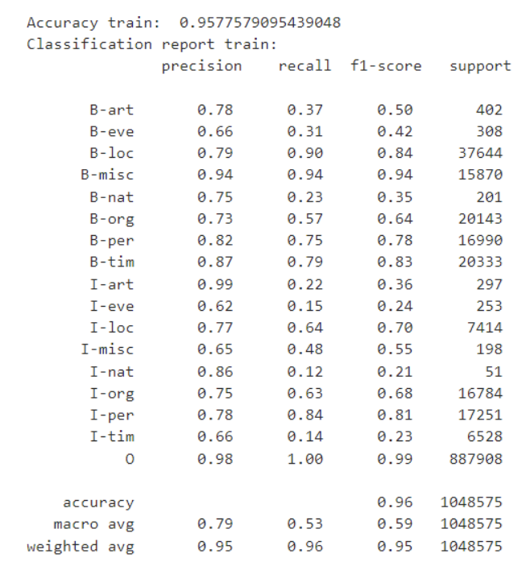
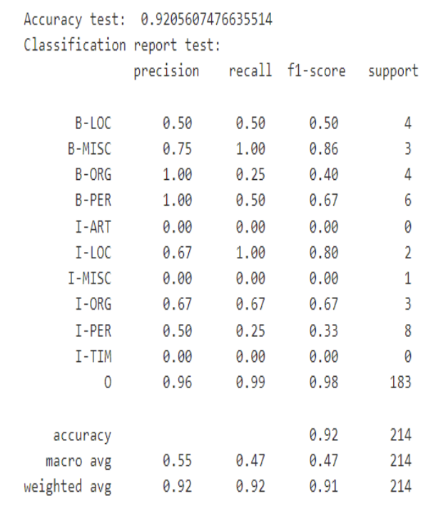

## Sentiment Analysis
### Methodology
- Naive Bayes classifier is a frequently used model for text classification in NLP research. 
- It performs well without high computational power requirements. Therefore, we used Naive Bayes classifier for the sentiment analysis. 
- For the feature extraction, we used Bag of Words approach with their corresponding information values using TF IDF method.

### Results

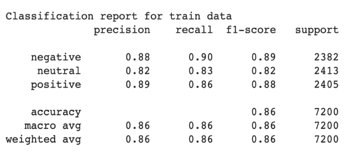
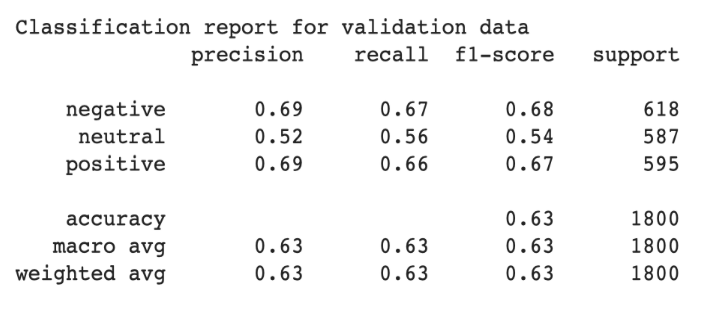
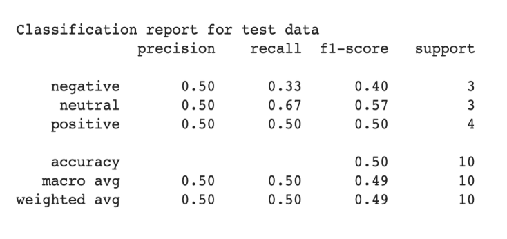

## Topic Analysis
For topic analysis we decided to deploy 2 different methodologies. One is classical ML other is RoBERTa (Robustly Optimized BERT Pretraining Approach) which is a variant of BERT that has a transformer based architecture. 
Our aim was to be able to see differences between two different family of approaches. 

### Methodology
#### SVM
- A Support Vector Machine (SVM) is a supervised learning model frequently used in text classification. 
- SVM’s map the data to a high-dimensional feature space to separate it into classes. 
- SVM’s are suitable for datasets with many dimensions and take a relatively short time to classify. This is the main reason why we chose an SVM with a validation set for the topic classification. 
- As the word contents of a text determines its topic without the need for the sequence, Bag of Words with TF IDF was used. 
#### RoBERTa
- RoBERTa is one of the state-of-the-art LLM pre-trained on a large corpus, using a transformer-based arch that allows it to capture long-range dependencies and context.
- Finetuning RoBERTa for a specific task and domain can help to adapt model better by improving its performance on that domain data.
- Pretrained RoBERTa is loaded using simpletransformers, and fine tuning is done in our generated dataset.
### Results

#### SVM
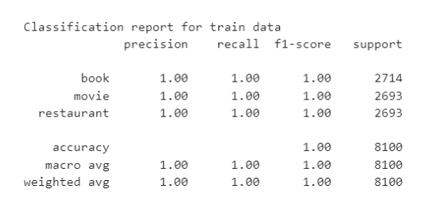
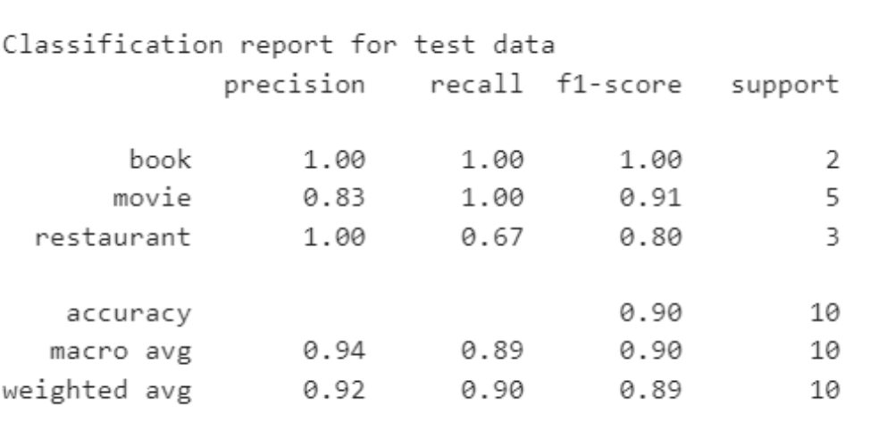
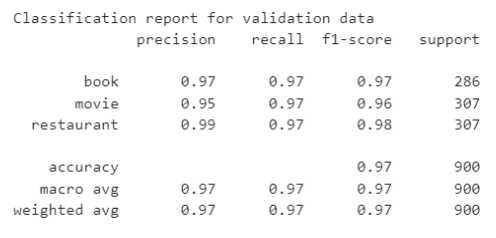

#### RoBERTa
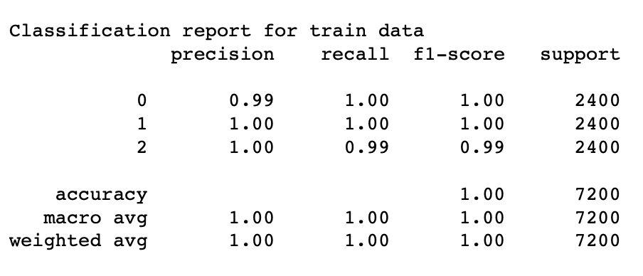
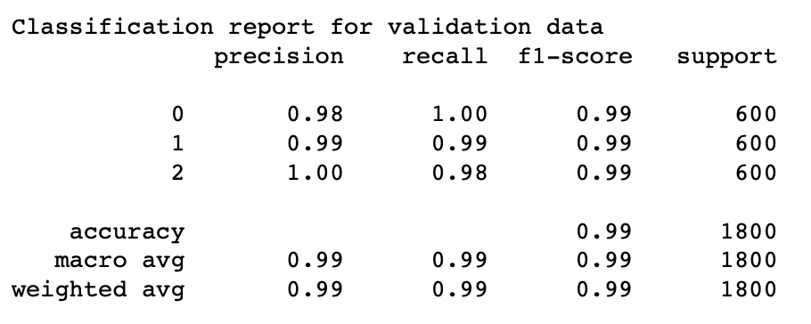
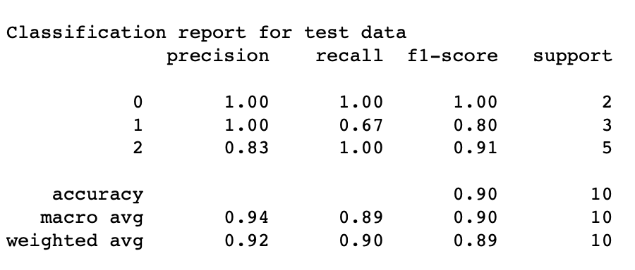

